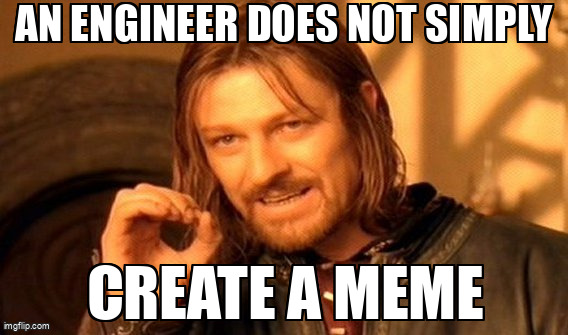

A simple demonstration of...
* audio recording, using the sounddevice library
* text-to-speech, using OpenAI's Whisper
* parsing natural language, using OpenAI's ChatGPT
* meme image generation, using ImgFlip's API

A sample audio file is included. It was used to create this image:

